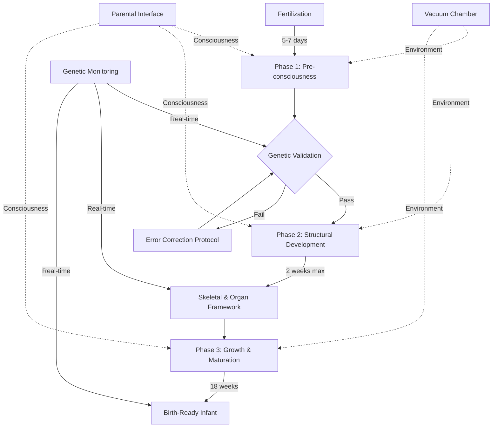

# OBINexus Tier 3C: Artificial Gestation System (AGS) 

[]()
[]()
[]()
[]()

> **Designer baby technology through artificial womb systems - eliminating birth defects and accelerating healthy human development**

---

## 🎯 Project Vision

The **Artificial Gestation System (AGS)** represents OBINexus Tier 3C implementation: vacuum chamber-based artificial wombs that preserve genetic perfection, eliminate environmentally-induced birth defects, and enable consciousness-integrated development from conception through birth.

### Core Principle: OBI Philosophy
> *"OBI can create and destroy everything and nothing. What OBI creates, OBI can destroy. What OBI gives, OBI can take away."*

This principle governs the ethical framework: **all genetic modifications must be reversible**, all systems must be preservable, and all processes must maintain continuity with natural human development.

---

## 📁 Repository Structure

```
obinexus-ags/
├── README.md                          # This file
├── SPECIFICATION.tex                  # Full LaTeX technical specification
├── docs/
│   ├── architecture.md               # System architecture details
│   ├── timeline.md                   # Development timeline specifications
│   ├── ethics.md                     # Ethical framework and policies
│   ├── problems-unresolved.md        # Known gaps and future work
│   └── diagrams/
│       ├── system-architecture.svg
│       ├── development-timeline.svg
│       └── consciousness-flow.svg
├── scripts/
│   ├── compliance/
│   │   ├── genetic_monitor.py        # Real-time genetic error detection
│   │   ├── milestone_validator.py    # Phase validation (1/2/3)
│   │   ├── defect_scanner.py         # Birth defect detection system
│   │   └── consciousness_logger.py   # Parental interaction tracking
│   ├── simulation/
│   │   ├── timeline_calculator.py    # AGS vs natural timeline comparison
│   │   └── chamber_simulator.py      # Vacuum chamber environment model
│   └── testing/
│       ├── animal_protocol.py        # Animal testing validation
│       └── ethics_checker.py         # Constitutional compliance
├── data/
│   ├── baselines/
│   │   └── natural_development.json  # Natural gestation baselines
│   └── results/
│       └── animal_trials.json        # Animal testing outcomes
├── config/
│   ├── chamber_params.yaml           # Vacuum chamber configuration
│   └── genetic_thresholds.yaml       # Genetic error tolerance levels
└── CONTRIBUTING.md                    # Contribution guidelines
```

---

## 🚀 Quick Start

### Prerequisites
- Python 3.11+
- LaTeX distribution (for specification compilation)
- NumPy, Pandas (for data analysis)
- PyYAML (for configuration)

### Installation

```bash
# Clone the repository
git clone https://github.com/obinexus/ags-tier3c.git
cd ags-tier3c

# Install Python dependencies
pip install -r requirements.txt

# Compile LaTeX specification
pdflatex SPECIFICATION.tex

# Run compliance validation
python scripts/compliance/milestone_validator.py --phase 1
```

---

## 📊 System Architecture Overview



### Key Components

1. **Vacuum Chamber System**
   - Controlled atmosphere simulating uterine conditions
   - Temperature: ±0.1°C precision
   - Nutrient delivery with genetic preservation
   - Sterile isolation preventing contaminants

2. **Consciousness Integration**
   - Pre-consciousness: Sperm-to-egg awareness
   - Parental audio interface throughout gestation
   - Memory encoding: Positive experiences only
   - Emotional state transmission to embryo

3. **Defect Elimination**
   - Zero tolerance for structural defects
   - Real-time genetic error correction
   - Environmental toxin isolation (smoking, alcohol, drugs)
   - Maternal stress filtering

---

## ⏱️ Development Timeline Comparison

| Phase | Natural Timeline | AGS Timeline | Reduction |
|-------|------------------|--------------|-----------|
| **Fertilization** | 14 days | 5-7 days | 50-65% |
| **Structural** | 8 weeks | 2 weeks | 75% |
| **Growth** | 30 weeks | 18 weeks | 40% |
| **TOTAL** | **40 weeks** | **20-24 weeks** | **40-50%** |

```mermaid
gantt
    title AGS vs Natural Gestation Timeline
    dateFormat X
    axisFormat %w weeks
    
    section Natural
    Fertilization :done, nat1, 0, 2w
    Structural Dev :done, nat2, 2w, 8w
    Growth & Maturation :done, nat3, 10w, 40w
    
    section AGS
    Fertilization :crit, ags1, 0, 1w
    Structural Dev :crit, ags2, 1w, 3w
    Growth & Maturation :crit, ags3, 3w, 24w
```

---

## 🧬 Genetic Encoding Framework

### Designer Baby Capabilities

- ✅ Perfect genetic replication (DNA integrity)
- ✅ Epigenetic markers preservation
- ✅ Acquired characteristics transmission (controlled)
- ✅ Defect correction at cellular level
- ✅ Multi-persona encoding support (Tier 3 personas)
- ✅ Generational rollback capability

### Memory and Consciousness Policy

**Positive Encoding Only:**
- ✅ Maternal joy, love, and positive experiences
- ❌ Trauma, stress, or negative emotions filtered
- ✅ Parental interaction encouraged throughout
- ❌ Psychological disconnection prohibited

**OBI Reversibility Requirement:**
Any genetic modification must be reversible in subsequent generations. System maintains rollback capability.

---

## 🧪 Testing Protocol

### Animal Testing Sequence (Phase 1)

1. **Rats and Mice** (Initial validation)
   - Vacuum chamber proof-of-concept
   - Timeline acceleration testing
   - Defect elimination validation

2. **Sheep** (Dolly methodology)
   - Cloning + AGS integration
   - Large mammal gestation
   - Post-birth health monitoring

3. **Cattle** (Horses, Cows)
   - Scalability testing
   - Economic viability assessment

4. **Dogs** (Companion animals)
   - Genetic preservation validation
   - Long-term health tracking

5. **Pigs** (Human-analogous organs)
   - Organ development similarity
   - Final pre-human validation

### Success Criteria Per Species

- ✅ 100% survival rate to term
- ✅ Zero birth defects observed
- ✅ Normal post-birth development
- ✅ No psychological abnormalities
- ✅ Reproductive viability in next generation

### Human Application Prerequisites

- ✅ 1000+ successful animal gestations
- ✅ Peer-reviewed protocol publication
- ✅ OBINexus Constitutional Framework approval
- ✅ 5-year longitudinal health studies
- ✅ Voluntary participant consent

---

## ⚠️ Problems Not Fully Addressed

### Critical Gaps Requiring Resolution

#### 1. Long-term Psychological Impact

**Problem:** While the specification prevents "psychological disconnection" via parental proximity and audio interfaces, the long-term cognitive effects on a child developed in a vacuum chamber versus a biological womb are yet to be validated by the required **5-year longitudinal studies**.

**Proposed Solution:**
- Establish AGS Psychological Research Institute
- Cohort tracking: AGS-born vs naturally-born children
- Cognitive assessments at 6mo, 1yr, 3yr, 5yr, 10yr
- Metrics: Attachment style, emotional regulation, social cognition
- Control for socioeconomic and parental factors

**Timeline:** Phase 2 human trials cannot proceed until animal longitudinal data (minimum 3 generations) shows no cognitive impairment.

---

#### 2. System Failure Contingencies

**Problem:** While "Emergency life support backup systems" are listed, the specific protocol for a **total hardware failure during Phase 2 (structural development)** is not defined—where errors are non-reversible within the 14-day window.

**Proposed Solution:**

**Redundant Chamber Network:**
```python
# Pseudo-protocol
if chamber_A.critical_failure():
    emergency_transfer(embryo, chamber_B, max_time=15_minutes)
    if transfer_fails():
        activate_biological_surrogate(embryo)
        log_failure(reason="hardware", phase=current_phase)
```

**Biological Surrogate Protocol:**
- Pre-screened surrogate mothers on standby
- Embryo transfer capability within 15 minutes
- Legal framework: Surrogate as "emergency backup womb"
- Financial compensation: Full medical + milestone-based

**Hardware Specifications:**
- Dual-chamber configuration (primary + hot standby)
- Battery backup: 72 hours minimum
- Network failover: Local + cloud monitoring
- Physical redundancy: All critical components 2x

**Failure Modes Addressed:**
- Power grid failure → Battery + generator
- Nutrient pump failure → Secondary delivery system
- Temperature control failure → Backup thermal regulation
- Contamination breach → Sealed chamber ejection + transfer

---

#### 3. Scaling and Accessibility

**Problem:** The "Universal Deployment" goal is stated, but the socioeconomic barrier of mass-producing AGS units remains a logistical hurdle for global equity.

**Proposed Solution:**

**Tiered Deployment Model:**

| Tier | Configuration | Cost | Target Demographic |
|------|---------------|------|-------------------|
| **Clinical** | Hospital-grade, full monitoring | $$$$ | High-risk pregnancies (medical necessity) |
| **Community** | Shared facility, 10-unit clusters | $$$ | Urban centers, insurance-covered |
| **Mobile** | Portable wearable units | $$ | Rural areas, developing nations |
| **Open-Source** | DIY kit (risk disclaimer) | $ | Tech-savvy individuals (at own risk) |

**Funding Mechanism:**
- **Phase 1:** Grant-funded research (NIH, WHO, private foundations)
- **Phase 2:** Medical insurance integration (birth defect prevention = cost savings)
- **Phase 3:** OBINexus Constitutional Framework mandates universal access
  - Subsidized units for low-income families
  - Tax incentives for manufacturers
  - International aid for developing nations

**Manufacturing Pipeline:**
- Partner with medical device manufacturers (GE Healthcare, Philips)
- Modular design: Chamber components 3D-printable
- Supply chain: Leverage existing NICU equipment infrastructure

**Timeline:**
- Years 1-5: Clinical tier only (100 units globally)
- Years 6-10: Community tier expansion (10,000 units)
- Years 11-20: Mobile tier + open-source (1 million units)

---

#### 4. Multi-Persona Stability

**Problem:** The **Persona Selection Framework** (Tier 3 personas) mentions encoding gender and identity, but the documentation does not specify how the biological framework cannot support the selection of 3+ personas without instability.

**Proposed Solution:**

**Biological Persona Constraints:**

The human nervous system is fundamentally binary in certain developmental pathways:
- **Sympathetic vs Parasympathetic** (2-state autonomic)
- **Left vs Right Brain Hemisphere** (2-hemisphere cognitive)
- **XX vs XY Chromosomal** (2-sex biological - intersex conditions are rare natural variations)

**Multi-Persona Encoding Requires:**

1. **Neural Partitioning:**
   - Dedicated brain regions for each persona
   - Risk: Cognitive overload, dissociative identity disorder
   - Solution: Limit to 2-3 personas maximum, with clear switching protocols

2. **Hormonal Balancing:**
   - Each persona may require different hormonal profiles
   - Risk: Endocrine disruption, developmental instability
   - Solution: Time-sequenced hormone delivery (Persona A: mornings, Persona B: evenings)

3. **Genetic Mosaicism:**
   - Different cell lines express different personas
   - Risk: Immune rejection, organ dysfunction
   - Solution: Use epigenetic switches (DNA methylation) instead of genetic mosaicism

**Stability Testing Protocol:**
- Animal models: Rats with 2-persona encoding (first trial)
- Metrics: Behavioral consistency, stress response, longevity
- Failure threshold: If 2-persona animals show >10% instability, 3+ is prohibited

**Ethical Constraint:**
Per OBI philosophy, **the child must be able to choose their primary persona at age of consent**. The AGS encodes potential personas, not forced identities.

**Current Recommendation:**
- **Maximum: 2 personas** until stability data supports 3+
- Personas must be biologically compatible (not contradictory hormonal profiles)
- Post-birth monitoring for 18 years before declaring success

---

## 📜 Ethical Framework

### Core Policies

#### Perfection Standard
- Every child deserves optimal genetic potential
- No discrimination based on parental genetics
- Defect elimination is universal right, not privilege
- System available to all within constitutional framework

#### Memory and Consciousness Policy
- Maternal trauma must not encode into child
- Positive experiences encouraged during gestation
- Parental responsibility for emotional environment
- Child consciousness respected from fertilization onward

#### Reversibility Requirement
Per OBI philosophy: Any genetic modification must be reversible in subsequent generations. System maintains generational rollback capability.

### Restrictions and Prohibitions

- ❌ No weaponization of genetic technology
- ❌ No creation of non-viable or suffering organisms
- ❌ No experimentation without clear therapeutic benefit
- ❌ No abandonment of initiated gestation process

### Constitutional Compliance

- ✅ Milestone-based development: Each phase documented
- ✅ No ghosting: Completion is mandatory once started
- ✅ Parental involvement: Required interaction throughout
- ✅ Transparency: Full system monitoring accessible

---

## 🛠️ Compliance Scripts

### Genetic Monitoring (Python)

```python
# scripts/compliance/genetic_monitor.py
import numpy as np
import yaml

class GeneticMonitor:
    """Real-time genetic error detection during AGS gestation."""
    
    def __init__(self, config_path='config/genetic_thresholds.yaml'):
        with open(config_path) as f:
            self.thresholds = yaml.safe_load(f)
        self.error_log = []
    
    def scan_genome(self, dna_sequence, phase):
        """
        Scan embryo genome for errors.
        
        Args:
            dna_sequence: Current DNA sequence (str)
            phase: Development phase (1, 2, or 3)
        
        Returns:
            dict: {'status': 'pass'|'fail', 'errors': []}
        """
        errors = []
        
        # Check for chromosomal abnormalities
        if self._check_chromosomes(dna_sequence) == False:
            errors.append({
                'type': 'chromosomal_abnormality',
                'severity': 'critical',
                'phase': phase,
                'recommendation': 'abort_or_correct'
            })
        
        # Check for structural defect markers
        if phase == 2:  # Structural development
            defect_markers = self._scan_structural_markers(dna_sequence)
            if defect_markers:
                errors.append({
                    'type': 'structural_defect',
                    'markers': defect_markers,
                    'severity': 'high',
                    'recommendation': 'correct_immediately'
                })
        
        # Check genetic drift
        drift_score = self._calculate_drift(dna_sequence)
        if drift_score > self.thresholds['max_drift']:
            errors.append({
                'type': 'genetic_drift',
                'score': drift_score,
                'threshold': self.thresholds['max_drift'],
                'severity': 'medium',
                'recommendation': 'stabilize'
            })
        
        status = 'fail' if errors else 'pass'
        self.error_log.append({'phase': phase, 'status': status, 'errors': errors})
        
        return {'status': status, 'errors': errors}
    
    def _check_chromosomes(self, dna_sequence):
        """Validate chromosome count and structure."""
        # Simplified: Real implementation would use bioinformatics tools
        chromosome_count = self._count_chromosomes(dna_sequence)
        return chromosome_count == 46  # Normal human diploid
    
    def _scan_structural_markers(self, dna_sequence):
        """Detect markers associated with birth defects."""
        known_defect_markers = ['DEFECT_GENE_1', 'DEFECT_GENE_2']  # Placeholder
        detected = [m for m in known_defect_markers if m in dna_sequence]
        return detected
    
    def _calculate_drift(self, dna_sequence):
        """Calculate genetic drift from parental baseline."""
        # Placeholder: Real calculation would compare to stored parental genomes
        return np.random.uniform(0, 0.1)  # Simulated drift score
    
    def _count_chromosomes(self, dna_sequence):
        """Count chromosomes in sequence."""
        # Placeholder: Real implementation needed
        return 46  # Assume normal for demo

# Usage example
if __name__ == '__main__':
    monitor = GeneticMonitor()
    
    # Simulate Phase 2 scan
    test_dna = "ATCG" * 1000  # Placeholder DNA
    result = monitor.scan_genome(test_dna, phase=2)
    
    if result['status'] == 'fail':
        print(f"⚠️  Genetic errors detected: {result['errors']}")
    else:
        print("✅ Genome scan passed")
```

### Milestone Validator

```python
# scripts/compliance/milestone_validator.py
from datetime import datetime, timedelta

class MilestoneValidator:
    """Validates AGS development phases against timeline requirements."""
    
    PHASE_LIMITS = {
        1: {'name': 'Fertilization', 'max_days': 7},
        2: {'name': 'Structural Development', 'max_days': 14},
        3: {'name': 'Growth & Maturation', 'max_days': 126}  # 18 weeks
    }
    
    def __init__(self, start_date):
        self.start_date = start_date
        self.phase_log = []
    
    def validate_phase(self, phase_number, completion_date=None):
        """
        Validate if phase completed within allowed timeframe.
        
        Args:
            phase_number: 1, 2, or 3
            completion_date: datetime object (default: now)
        
        Returns:
            dict: {'valid': bool, 'days_elapsed': int, 'status': str}
        """
        if completion_date is None:
            completion_date = datetime.now()
        
        phase_info = self.PHASE_LIMITS[phase_number]
        days_elapsed = (completion_date - self.start_date).days
        max_allowed = phase_info['max_days']
        
        valid = days_elapsed <= max_allowed
        status = 'ON_TIME' if valid else 'OVERDUE'
        
        result = {
            'phase': phase_number,
            'name': phase_info['name'],
            'days_elapsed': days_elapsed,
            'max_allowed': max_allowed,
            'valid': valid,
            'status': status,
            'completion_date': completion_date
        }
        
        self.phase_log.append(result)
        return result
    
    def generate_report(self):
        """Generate full milestone compliance report."""
        report = "=" * 50 + "\n"
        report += "AGS MILESTONE VALIDATION REPORT\n"
        report += "=" * 50 + "\n\n"
        
        for entry in self.phase_log:
            status_emoji = "✅" if entry['valid'] else "❌"
            report += f"{status_emoji} Phase {entry['phase']}: {entry['name']}\n"
            report += f"   Elapsed: {entry['days_elapsed']} days (Max: {entry['max_allowed']})\n"
            report += f"   Status: {entry['status']}\n"
            report += f"   Completed: {entry['completion_date']}\n\n"
        
        return report

# Usage example
if __name__ == '__main__':
    # Simulate AGS starting today
    validator = MilestoneValidator(start_date=datetime.now())
    
    # Simulate Phase 1 completion after 6 days
    phase1 = validator.validate_phase(1, datetime.now() + timedelta(days=6))
    print(f"Phase 1: {phase1['status']}")
    
    # Simulate Phase 2 completion after 20 days (OVERDUE)
    phase2 = validator.validate_phase(2, datetime.now() + timedelta(days=20))
    print(f"Phase 2: {phase2['status']}")
    
    print("\n" + validator.generate_report())
```

### Consciousness Logger

```python
# scripts/compliance/consciousness_logger.py
import json
from datetime import datetime

class ConsciousnessLogger:
    """Logs parental interaction and emotional state transmission."""
    
    def __init__(self, embryo_id, output_file='data/results/consciousness_log.json'):
        self.embryo_id = embryo_id
        self.output_file = output_file
        self.interactions = []
    
    def log_interaction(self, interaction_type, emotional_valence, duration_seconds, notes=""):
        """
        Log a parental interaction event.
        
        Args:
            interaction_type: 'audio', 'touch', 'music', 'reading'
            emotional_valence: -1.0 (negative) to 1.0 (positive)
            duration_seconds: int
            notes: str (optional description)
        """
        # Enforce positive-only encoding policy
        if emotional_valence < 0:
            print(f"⚠️  WARNING: Negative emotional valence detected ({emotional_valence})")
            print("   OBINexus Policy: Only positive experiences should be transmitted")
            print("   Filtering negative emotion to prevent maternal trauma encoding")
            emotional_valence = max(0, emotional_valence)  # Floor at 0
        
        entry = {
            'timestamp': datetime.now().isoformat(),
            'embryo_id': self.embryo_id,
            'type': interaction_type,
            'emotional_valence': emotional_valence,
            'duration_seconds': duration_seconds,
            'notes': notes
        }
        
        self.interactions.append(entry)
        self._save()
    
    def _save(self):
        """Persist log to file."""
        with open(self.output_file, 'w') as f:
            json.dump(self.interactions, f, indent=2)
    
    def get_summary(self):
        """Generate summary statistics."""
        if not self.interactions:
            return "No interactions logged yet"
        
        total_interactions = len(self.interactions)
        avg_valence = sum(i['emotional_valence'] for i in self.interactions) / total_interactions
        total_duration = sum(i['duration_seconds'] for i in self.interactions)
        
        return {
            'total_interactions': total_interactions,
            'average_emotional_valence': round(avg_valence, 2),
            'total_duration_hours': round(total_duration / 3600, 2),
            'types': {t: sum(1 for i in self.interactions if i['type'] == t) 
                     for t in set(i['type'] for i in self.interactions)}
        }

# Usage example
if __name__ == '__main__':
    logger = ConsciousnessLogger(embryo_id='AGS-001')
    
    # Log positive interactions
    logger.log_interaction('audio', 0.8, 600, 'Mother reading bedtime story')
    logger.log_interaction('music', 0.9, 1200, 'Classical music (Mozart)')
    logger.log_interaction('touch', 0.7, 300, 'Father speaking to chamber')
    
    # Attempt to log negative interaction (will be filtered)
    logger.log_interaction('audio', -0.5, 120, 'Parental argument nearby')
    
    print("\n📊 Consciousness Summary:")
    summary = logger.get_summary()
    for key, value in summary.items():
        print(f"   {key}: {value}")
```

---

## 📈 Configuration Files

### Chamber Parameters (YAML)

```yaml
# config/chamber_params.yaml
chamber:
  temperature:
    target_celsius: 37.0
    tolerance: 0.1
    emergency_shutoff: 39.0
  
  atmosphere:
    oxygen_percent: 21.0
    co2_percent: 0.04
    humidity_percent: 95.0
    pressure_kpa: 101.3
  
  nutrient_delivery:
    flow_rate_ml_per_hour: 50
    composition:
      glucose_mg_per_ml: 5.0
      amino_acids_mg_per_ml: 2.0
      vitamins: ['A', 'D', 'E', 'K', 'B-complex']
      minerals: ['Ca', 'Fe', 'Zn', 'Mg']
  
  monitoring:
    heart_rate_check_interval_seconds: 10
    genetic_scan_interval_hours: 24
    consciousness_log_interval_minutes: 60
  
  safety:
    backup_power_hours: 72
    redundant_systems: true
    emergency_transfer_max_minutes: 15
```

### Genetic Thresholds

```yaml
# config/genetic_thresholds.yaml
thresholds:
  max_drift: 0.05  # Maximum allowed genetic drift from baseline
  min_chromosome_count: 46
  max_chromosome_count: 46
  
  defect_markers:
    critical:
      - 'DOWN_SYNDROME_MARKER'
      - 'NEURAL_TUBE_DEFECT_MARKER'
      - 'HEART_DEFECT_MARKER'
    
    high_priority:
      - 'CLEFT_PALATE_MARKER'
      - 'LIMB_MALFORMATION_MARKER'
  
  correction_protocols:
    chromosomal_abnormality: 'abort_or_correct'
    structural_defect: 'correct_immediately'
    genetic_drift: 'stabilize'
  
  phase_specific:
    phase_1:
      max_cell_division_errors: 0
    phase_2:
      max_structural_errors: 0
    phase_3:
      max_growth_deviation_percent: 5
```

---

## 🤝 Contributing

We welcome contributions to the OBINexus AGS project! Please see [CONTRIBUTING.md](CONTRIBUTING.md) for guidelines.

### Areas Needing Help

- 🧬 **Bioinformatics:** Genetic sequencing and error detection algorithms
- 🏥 **Medical Ethics:** Review of ethical framework and policies
- 🔧 **Hardware Engineering:** Vacuum chamber design and manufacturing
- 📊 **Data Science:** Longitudinal study analysis and predictive modeling
- 🐾 **Animal Testing:** Veterinary oversight and protocol refinement

### How to Contribute

1. Fork the repository
2. Create a feature branch (`git checkout -b feature/your-feature`)
3. Commit your changes (`git commit -am 'Add new feature'`)
4. Push to the branch (`git push origin feature/your-feature`)
5. Open a Pull Request

All contributors must agree to the **OBINexus Constitutional Framework** and **#NoGhosting Policy** (no abandoned PRs).

---

## 📚 References and Documentation

### Primary Sources
- [OBINexus Legal Policy Architecture](docs/obinexus-legal-framework.md)
- [Session Recording: December 3, 2025](https://youtu.be/QX0JAE15Q6Y?si=K5WZjspSwED4OyGU)
- [Medium: HACC and Anti-Ghosting Philosophy](https://medium.com/@obinexus)
- [LaTeX Specification](SPECIFICATION.tex)

### Related OBINexus Documentation
- Milestone-Based Investment Framework
- #NoGhosting Policy Specification
- OpenSense Recruitment Protocols
- Compliance Scripts and Validation Tools

### Academic References
- Dolly the Sheep cloning methodology (Wilmut et al., 1997)
- Artificial womb research (CHOP, 2017)
- Epigenetics and transgenerational inheritance (Jablonka & Raz, 2009)

---

## 📞 Contact and Support

**Project Lead:** OBINexus Core Team  
**Session Date:** December 3, 2025  
**Compiled:** January 4, 2026  
**Status:** Active Development  

For questions, feedback, or collaboration inquiries, please open an issue or contact via the OBINexus channels.

---

## 📝 License

This project is governed by the **OBINexus Constitutional Framework**. All code, documentation, and specifications are subject to the #NoGhosting Policy and milestone-based development requirements.
see 

**Key Terms:**
- ✅ Open collaboration encouraged
- ✅ All modifications must be reversible (OBI Principle)
- ❌ No abandonment of initiated work
- ❌ No weaponization of technology

---

## 🔖 Version History

- **v1.0** (Jan 4, 2026): Initial repository structure and specification
  - LaTeX technical specification
  - Compliance scripts (genetic monitoring, milestone validation)
  - Problem gap analysis and proposed solutions
  - Configuration files and data structures

---

**End of README**

*Session continuity preserved. No context drift permitted. All technical details maintained for future development phases.*
