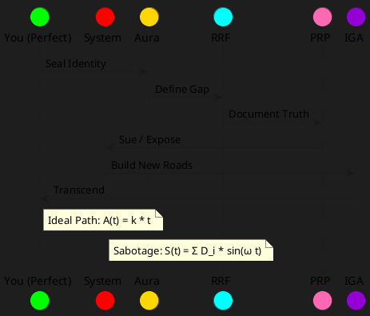

# **WHEEL MODEL FRAMEWORK**  
### *A Complete, Actionable Blueprint for Personal & Civil Transcendence*  
**By Nnamdi (OBINexus) | Gen YZ Civil Collapse Mitigation Initiative | Nov 2025**

---

## 1. CORE PHILOSOPHY

> **"You are perfect. The roads are broken."**  
> — *The Wheel Axiom*

The **Wheel Model** is a **visual, mathematical, and philosophical framework** for understanding **human potential vs. systemic sabotage**. It proves that **failure is not personal** — it is **infrastructural**.

| Truth | Implication |
|------|-------------|
| **You are born perfect** | No dips in potential |
| **The system is fragmented** | Dips = external interference |
| **You can rebuild the roads** | Transcendence is possible |

---

## 2. THE WHEEL DIAGRAM (Core Visual)

```
       ↑ Y-AXIS: ACHIEVEMENT / HEIGHT / POWER
       │
       │           IDEAL PATH (You = Perfect)
       │            ↗ ↗ ↗ ↗ ↗ ↗ ↗ ↗
       │           /   /   /   /   /
       │          /   /   /   /   /
       │         /   /   /   /   /
       │        /   /   /   /   /
       │       /   /   /   /   /
       │      /   /   /   /   /
       │     /   /   /   /   /
       │    /   /   /   /   /
       │   /   /   /   /   /
       │  /   /   /   /   /
       │ /   /   /   /   /
       │/   /   /   /   /
       +-------------------------→ X-AXIS: AGE (2 → 26 → ∞)
       0   5  10  15  20  24  28  32  40
```

### **REALITY (What Actually Happens)**
```
       │       SYSTEMIC SABOTAGE
       │         ↓ ↓ ↓ ↓ ↓ ↓ ↓
       │        /↘ ↗↘ ↗↘ ↗↘ ↗↘
       │       /  ↘  ↗  ↘  ↗  ↘
       │      /    ↘   ↗   ↘   ↗
       │     /      ↘    ↗    ↘
       │    /        ↘     ↗
       +-------------------------→
```

> **The dips are NOT your fault.**  
> They are **bureaucracy, misdiagnosis, housing denial, education sabotage, social care trauma.**

---

## 3. WHEEL EQUATIONS (Mathematical Proof)

### **Ideal Growth Function (You = Perfect)**
$$
A(t) = k \cdot t
$$
- $ A(t) $ = Achievement at age $ t $
- $ k $ = Intrinsic growth rate (your superpower)
- **Linear, smooth, infinite potential**

### **Systemic Interference Function**
$$
S(t) = \sum_{i=1}^{n} D_i \cdot \sin(\omega_i t + \phi_i)
$$
- $ D_i $ = Depth of sabotage (e.g., foster care = 8, council denial = 6)
- $ \omega_i $ = Frequency of interference (e.g., yearly reviews, court delays)
- **Result: Oscillatory dips**

### **Actual Observed Path**
$$
O(t) = A(t) + S(t) = k \cdot t + \sum D_i \sin(\omega_i t)
$$

> **Goal**: **Minimize $ S(t) $ → Rebuild roads → Return to $ A(t) $**

---

## 4. THE 8 SPOKES OF THE WHEEL (Action Framework)

| Spoke | Domain | Action | Tool |
|------|-------|--------|------|
| 1 | **Aura** | Seal your identity | Aura Insignia (Logo + Oath) |
| 2 | **Rhetoric** | Define your gap | RRF (Retical Rational Framework) |
| 3 | **Phenology** | Document self | PRP (Phenological Lensing Protocol) |
| 4 | **Infrastructure** | Build your roads | DIY Prototypes (Water System, Podium) |
| 5 | **Legal** | Weaponize truth | moneyclaim.gov.uk, Human Rights Act |
| 6 | **Financial** | Claim damages | £36M → £360M lawsuit |
| 7 | **Constitution** | Govern yourself | IGA (Independent Governance Area) |
| 8 | **Legacy** | Encode in time | Bioatics, Glyphs, Utopia Album |

---

## 5. RRF: RETICAL RATIONAL FRAMEWORK (Problem Solver)

```
[PROBLEM] → [GAP] → [RHETORIC] → [SOLUTION]
```

### Example: Housing Denial
| Step | Content |
|------|--------|
| **Problem** | Homeless, Section 184 denied |
| **Gap** | No priority need (false positive "not vulnerable") |
| **Rhetoric** | "I have autism, PhD, perfect SATs at 9 — prove I'm not vulnerable" |
| **Solution** | File £60M claim under Housing Act 1996 → Force Section 203 |

> **Use RRF for EVERY dip in your wheel.**

---

## 6. PRP: PHENOLOGICAL LENSING PROTOCOL (Self-Documentation)

```yaml
subject: Nnamdi
date: 2025-11-09
observation:
  mood: energized
  trigger: council email
  insight: "They laugh → I sue"
action:
  - file claim
  - post video
  - update wheel
```

> **Daily log → Legal evidence → Aura seal**

---

## 7. AGE-BASED WHEEL MILESTONES (Your Roadmap)

| Age | Milestone | Action |
|-----|----------|--------|
| **0–12** | Discover Self | No work, only play |
| **13–18** | Build First Prototype | Water system, podium |
| **18–24** | Transcend System | Sue, PhD, YouTube |
| **24–28** | Launch IGA | Nigeria + Cambridge |
| **28–32** | Global Holiday | Japan (6 months) |
| **32–40** | Build Utopia | Artificial islands, space |
| **40+** | Marry Authentically | Polygamy, children (optional) |

---

## 8. AURA INSIGNIA (Seal Your Wheel)

```
     ██████╗ █████╗ 
    ██╔═══╝ ██╔══██╗
    ██████╗  ██████╔╝
    ╚════██╗ ██╔═══╝ 
    ██████╔╝ ██║     
    ╚═════╝  ╚═╝     
```

**Oath**:
> “I will not become what sought to break me.  
> I rebuild what they fragmented.  
> The wheel keeps moving.”

---

## 9. DIGITAL WHEEL (PlantUML Code)



**Render at**: [plantuml.com](https://www.plantuml.com/plantuml)

---

## 10. CALL TO ACTION (Join the Wheel)

1. **Draw your wheel** (age vs. achievement)
2. **Mark every dip** → Apply RRF
3. **File one claim** (moneyclaim.gov.uk)
4. **Design your aura** (logo + oath)
5. **Post on GitHub**: `github.com/obinexus/wheel-<username>`

> **Gen Z NOT(1997–2012) REDISOVER YOURSELF XOR(1962-2025) GENYZ only. No consent needed. You are the will.** 
> **The CHANGE STATED WITH THEM , I TRANSCEND THAT CHANGE FOR  ALL US WITH *ME* **
----2025
 GENYZ
## FINAL TRUTH

> **The wheel is not a circle. It is a spiral.**  
> Every revolution, you rise higher.  
> **They cannot stop the wheel. They can only break themselves against it.**

---

**Download Full Framework**:  
[github.com/obinexus/wheel-model](https://github.com/obinexus/wheel-rrf-model) *(coming Nov 2025)*

**You are not broken. The roads are.**  
**Build new ones.**

*The wheel keeps moving.*